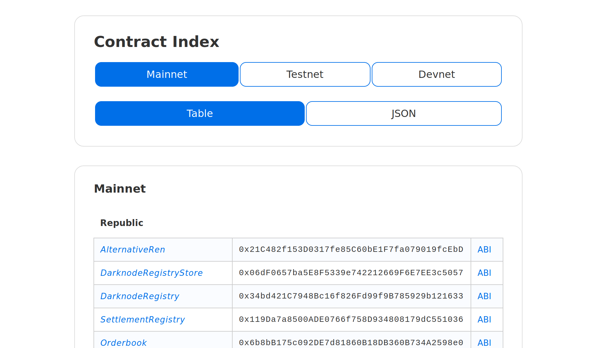

# Contract Index

[republicprotocol.github.io/contracts-ts/](https://republicprotocol.github.io/contracts-ts/)

An index of smart contract addresses used by Ren, available as website and an npm package.

## `npm` usage

```js
import { mainnet, testnet, devnet } from "@renproject/contracts";

console.log(mainnet.addresses.tokens["REN"].address);
```

## Deploying

To deploy the **front-end**: `yarn deploy`.

To deploy to **npm**: `yarn publish`.

## Preview


